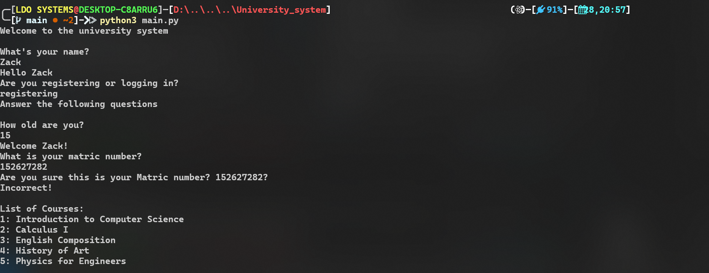
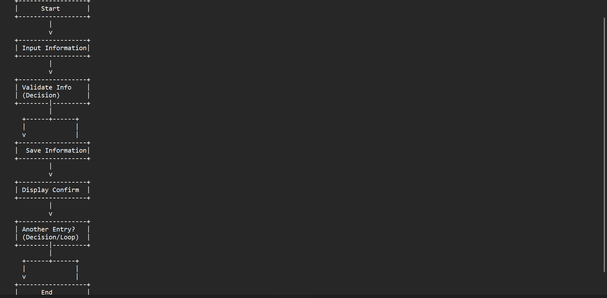

# University system

University system is a student biodata program that contains details of students it uses the nigerian university system of study.

## Installation

Clone the repository

```bash
git clone github.com/king101-bit/university-system
cd university_system/university_system
```

## Usage

```python
python3 main.py
```


## Flowchart
It just shows the code in a procedural way and how it works in the form of steps.



## Contributing

Pull requests are welcome. For major changes, please open an issue first
to discuss what you would like to change.

Please make sure to update tests as appropriate.

## License

[MIT](https://choosealicense.com/licenses/mit/)